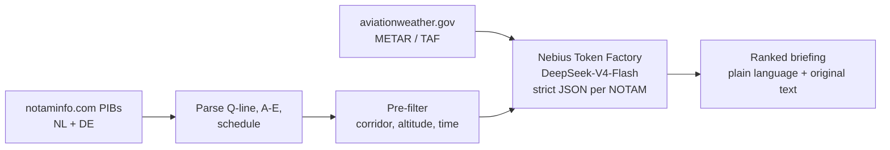

# NOTAM Brief

Route-specific NOTAM and weather briefing for VFR pilots in the Netherlands and Germany (AI Innovate Amsterdam).

The pilot enters departure, destination and planned time. The system takes the complete national NOTAM set
(a few hundred items for NL, about 800 for DE), keeps only what affects that flight, ranks it by operational
importance, and explains each item in plain language next to the original ICAO text. It is decision support,
not an authority: the pilot in command makes the final decision.

## Quick start

```bash
conda env create -f environment.yml
conda activate notam
copy .env.example .env            # then put your Nebius Token Factory key (and ElevenLabs key) in .env
uvicorn app:app --port 8765
```

Open http://localhost:8765, click one of the five test routes (or type any NL/DE aerodrome codes) and press
**Get briefing**. Choose **Snapshot 2026-09-22 (labelled test set)** under *NOTAM data* to reproduce the
labelled scenario, or **Live bulletins** for today's NOTAMs.

From the command line:

```bash
python -m briefing.pipeline EHLE EHHV --time 2026-09-23T09:00
python -m briefing.pipeline EHRD EHTX --via 52.10,4.27 52.46,4.57 52.95,4.72 --source 2026-09-22
```

## How it works



1. **Ingest** ([briefing/ingest.py](briefing/ingest.py)): fetch the NL and DE Pre-flight Information
   Bulletins, split them into FIR, section and aerodrome, and parse each NOTAM. The Q-line gives FIR, Q-code,
   traffic, purpose, scope, lower and upper limit, centre and radius. Items A, B, C and E and any schedule are
   parsed too. Live bulletins are cached for three hours.
2. **Pre-filter** ([briefing/prefilter.py](briefing/prefilter.py), called from `brief()` in
   [briefing/pipeline.py](briefing/pipeline.py)): plain Python in the app's own process. No model and no
   network are involved. A NOTAM is kept when:
   - its Q-line circle comes within its radius + 10 nm of the route,
   - its altitude band overlaps the flight, and
   - its validity overlaps the flight window.

   Departure, destination and alternate NOTAMs are always kept. The margins are generous because recall
   matters more than precision here.

   Scanning all 945 NL + DE NOTAMs takes about **4.5 ms per route**, roughly 5 µs per NOTAM (see
   [eval/results/prefilter_timing.md](eval/results/prefilter_timing.md), `python -m eval.time_prefilter`).
   Parsing both bulletins takes 50 ms, once per refresh.

   For every kept NOTAM the pre-filter also computes its position relative to the route, for example
   *"circle centre 5.3 nm left of the track, abeam a point 6 nm after departure"*. The UI shows it on each card.
3. **Weather** ([briefing/weather.py](briefing/weather.py)): METAR and TAF for departure and destination.
   Small fields without a METAR (EHHV, EHTE, EHHO, EHTX, EHTW) use the nearest reporting station.
4. **Model stage** ([briefing/llm.py](briefing/llm.py), [prompts/system_prompt.md](prompts/system_prompt.md)):
   the surviving NOTAMs, the route and the weather go to an open-weight model on Nebius Token Factory. The
   default model is `deepseek-ai/DeepSeek-V4-Flash-0731`. It returns strict JSON for each NOTAM: relevant,
   priority, a one-line reason and a plain-language summary. The JSON schema pins the NOTAM ids and the item
   count. If a response is truncated or invalid, the chunk is split and retried. Any NOTAM the model still
   skips is shown to the pilot as *not assessed*, never dropped silently.
5. **Output** ([app.py](app.py), [static/index.html](static/index.html)): weather at the top, then the
   ranked items with the original ICAO text beside each one, then the NOTAMs judged not relevant with the
   reasons.
6. **Voice summary** ([briefing/voice.py](briefing/voice.py), [prompts/voice_prompt.md](prompts/voice_prompt.md)):
   the **Listen** button sends the HIGH and MEDIUM items to the same model. The model turns them into a short
   spoken brief: facts only, similar items grouped, and no ids, coordinates or advice. ElevenLabs then reads
   the brief aloud and the page shows the transcript.
   - Every number in a spoken sentence must appear in the summaries that sentence came from. If it doesn't,
     the summaries themselves are read instead. The same applies to any item the model leaves out.
   - On the five test routes the spoken brief is 27-127 words, against 97-334 words in the written summaries.
   - The model takes about 2.5 s and ElevenLabs about 5-7 s.
   - Needs `ELEVENLABS_API_KEY` in `.env`.

## Results so far

DeepSeek-V4-Flash-0731 on Nebius Token Factory, on the five labelled routes (snapshot 2026-09-22).
The full table is in [eval/results/latest.md](eval/results/latest.md).

| Pre-filter | Distance hints to model | Reasoning | Recall | Precision | Items to read | NOTAMs sent | Cost / briefing | Model latency |
|---|---|---|---|---|---|---|---|---|
| on | off | off | **100%** | 64% | 7.5 | 30 | **$0.0014** | 14 s |
| on | on | off | 100% | 56% | 8.5 | 30 | $0.0016 | 14 s |
| on | off | on | 96% | 79% | 5.8 | 30 | $0.0024 | 39 s |
| off | off | off | 75% | 47% | 7.6 | 457 | $0.0167 | 36 s |

- With the pre-filter and reasoning off, the model caught every labelled NOTAM. The pilot reads about 8 items
  instead of 132 (NL) or 945 (NL + DE), at well under a cent per briefing. The pre-filter itself takes about
  4.5 ms.
- Without the pre-filter, recall falls to 75%. On the cross-border route 4 the model missed all five wind farms
  near the track, and it cost 12 times as much. The geometric pre-filter does work the model cannot do reliably
  from raw coordinates.
- Giving the model each NOTAM's computed distance from the route (3 runs per setting) did not help. It made the
  model flag items it had rightly ignored, such as offshore wind farms 8-11 nm away, and it still flagged
  obstacles 5-8 nm off track despite a 5 nm rule. The distance is shown to the pilot but is off for the model by
  default (`--hints on` to test it). A fixed distance cut-off belongs in the deterministic pre-filter.
- Turning reasoning on makes the output shorter, but it is 3 times slower and missed one LOW item.
  Reasoning is off by default (`BRIEFING_REASONING_EFFORT`).

These results are measured against **draft labels** that still need to be checked by a pilot (issue #1).

## Evaluation

| File | What it is |
|---|---|
| [eval/routes.json](eval/routes.json) | The five test routes, flight window, altitude band and corridor used for labelling |
| [eval/routes/](eval/routes) | Each route's pre-filtered NOTAMs, verbatim and in bulletin order |
| [eval/labels.json](eval/labels.json) | Draft relevance labels with priority and plain-language summary (**to be verified by a pilot**) |
| [eval/labels_flat.csv](eval/labels_flat.csv) | Scoring key generated from the labels (`python -m eval.build_labels`) |
| [eval/labels_review.html](eval/labels_review.html) | Review page for the labels |
| [eval/results/latest.md](eval/results/latest.md) | Latest benchmark summary |

```bash
python -m eval.bench                                            # default model, pre-filter on
python -m eval.bench --models deepseek-ai/DeepSeek-V4-Flash-0731 <other-model> --modes prefilter full
python -m eval.bench --hints on off --repeat 3 --parallel 10    # distance hints A/B, 3 runs each
python -m eval.time_prefilter                                   # pre-filter timing only, no model
```

For each route the benchmark reports:

- recall against the labels. This is the metric that matters, because a missed relevant NOTAM is the real
  failure.
- precision
- the number of items the pilot must read
- tokens in and out, cost per briefing and latency

It runs on the frozen snapshot in `data/snapshots/2026-09-22/`. `--modes full` sends the whole national set
without the pre-filter, chunked into 80 NOTAMs per request. Run `pytest` to check that the snapshot still
produces exactly the labelled candidate sets.

## Data sources and caveats

- **NOTAMs:** [notaminfo.com](https://notaminfo.com/latest?country=Netherlands). These are EAD-derived PIBs,
  free and refreshed daily, but **not official documents**. Production would take data from EUROCONTROL EAD
  directly or through a licensed connected provider such as autorouter.
- **Weather:** [aviationweather.gov data API](https://aviationweather.gov/data/api/) for METAR and TAF.
- **Aerodromes:** [OurAirports](https://ourairports.com/data/) (public domain), filtered to NL, DE, BE and LU.
- **Model:** [Nebius Token Factory](https://tokenfactory.nebius.com/), an OpenAI-compatible API
  (`https://api.tokenfactory.nebius.com/v1`). Set `NEBIUS_API_KEY` in `.env`. On Windows a key set with
  `setx` is also picked up.
- **Voice:** [ElevenLabs text-to-speech](https://elevenlabs.io/docs/api-reference/text-to-speech/convert) with
  the `eleven_multilingual_v2` model.

## Layout

```
app.py                  FastAPI demo server
static/index.html       demo UI
briefing/               ingest, prefilter, weather, llm, pipeline, voice
prompts/                system_prompt.md, voice_prompt.md
eval/                   routes, labels, benchmark, results
data/snapshots/         frozen bulletins used for evaluation
data/aerodromes.csv     aerodrome coordinates
tests/                  snapshot regression tests
```
