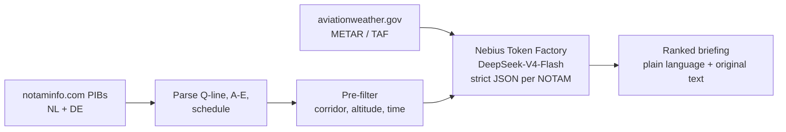

# NOTAM Brief

Before every flight, a pilot has to check the NOTAMs. These are short official notices about temporary hazards and
changes, such as:
- a closed runway
- a crane next to an airfield
- parachute jumping or a military exercise
- a radio frequency that is out of service

They are written in an abbreviated code and published country by country. For a short flight inside the
Netherlands, that means reading the whole Dutch bulletin: 132 NOTAMs in our test snapshot. The German bulletin
has about 800 more. Usually only about eight of them affect the flight. Finding those few is slow, and missing one
is a safety risk.

NOTAM Brief does that sorting for private pilots who fly by sight (VFR, visual flight rules) in the Netherlands and
Germany.
- You enter your departure, destination and time.
- It keeps only the NOTAMs that affect that flight, ranks them by importance, and explains each one in plain
  English next to the original text.
- It also summarises the weather and can read out a short spoken briefing.

It supports the pilot's decision; the pilot in command still makes it.


*A live briefing from Lelystad to Hilversum. The Dutch bulletin held 132 NOTAMs, 25 were near the route, height
and time, and 8 affect the flight: 4 high, 3 medium and 1 low priority.*

## About this project

A one-person sprint project for the AI Innovate Amsterdam hackathon (September 2026). It is a small working
prototype, not a finished or certified product.

- It works for any flight between aerodromes in the Netherlands and Germany, optionally via waypoints.
- Five test routes are used to measure how accurate it is. The expected answers for those routes are drafts that
  a pilot still has to check.
- The NOTAMs come from a free, unofficial copy of the official bulletins, not from the official source.

## Quick start

You need conda (Miniconda is enough) and a [Nebius Token Factory](https://tokenfactory.nebius.com/) API key.
An ElevenLabs key is only needed for the spoken summary.

```bash
conda env create -f environment.yml   # env already exists? conda env update -f environment.yml
conda activate notam
cp .env.example .env                  # Windows: copy .env.example .env; then add your keys to .env
uvicorn app:app --port 8765
```

Open http://localhost:8765, click one of the five test routes (or type any NL/DE aerodrome codes) and press
**Get briefing**. Under **Options → NOTAM data**, choose **Snapshot 2026-09-22 (labelled test set)** to reproduce
the labelled scenario, or **Live bulletins** for today's NOTAMs. Locally the app needs no sign-in unless you set
the Firebase variables (see [Deploy](#deploy)).

From the command line:

```bash
python -m briefing.pipeline EHLE EHHV --time 2026-09-23T09:00
python -m briefing.pipeline EHRD EHTX --via 52.10,4.27 52.46,4.57 52.95,4.72 --source 2026-09-22
```

## How it works



1. **Ingest** ([briefing/ingest.py](briefing/ingest.py)): fetch the NL and DE Pre-flight Information
   Bulletins, split them into FIR, section and aerodrome, and parse each NOTAM. The Q-line gives FIR, Q-code,
   traffic, purpose, scope, lower and upper limit, centre and radius. Items A, B, C and E and any schedule are
   parsed too. Live bulletins are cached for three hours.
2. **Pre-filter** ([briefing/prefilter.py](briefing/prefilter.py), called from `brief()` in
   [briefing/pipeline.py](briefing/pipeline.py)): plain Python in the app's own process. No model and no
   network are involved. A NOTAM is kept when:
   - its Q-line circle comes within its radius + 10 nm of the route,
   - its altitude band overlaps the flight, and
   - its validity overlaps the flight window.

   Departure, destination and alternate NOTAMs are always kept. The margins are generous because recall
   matters more than precision here.

   Scanning all 945 NL + DE NOTAMs takes about **4.5 ms per route**, roughly 5 µs per NOTAM (see
   [eval/results/prefilter_timing.md](eval/results/prefilter_timing.md), `python -m eval.time_prefilter`).
   Parsing both bulletins takes 50 ms, once per refresh.

   For every kept NOTAM the pre-filter also computes its position relative to the route, for example
   *"circle centre 5.3 nm left of the track, abeam a point 6 nm after departure"*. The UI shows it on each card.
3. **Weather** ([briefing/weather.py](briefing/weather.py)): METAR and TAF for departure and destination.
   Small fields without a METAR (EHHV, EHTE, EHHO, EHTX, EHTW) use the nearest reporting station.
4. **Model stage** ([briefing/llm.py](briefing/llm.py), [prompts/system_prompt.md](prompts/system_prompt.md)):
   the surviving NOTAMs, the route and the weather go to an open-weight model on Nebius Token Factory. The
   default model is `deepseek-ai/DeepSeek-V4-Flash-0731`. It returns strict JSON for each NOTAM: relevant,
   priority, a one-line reason and a plain-language summary. The JSON schema pins the NOTAM ids and the item
   count. If a response is truncated or invalid, the chunk is split and retried. Any NOTAM the model still
   skips is shown to the pilot as *not assessed*, never dropped silently.
5. **Output** ([app.py](app.py), [static/index.html](static/index.html)):
   - A route map shows the track and the area of each relevant NOTAM, coloured by priority. Clicking an area
     jumps to its card.
   - An at-a-glance panel beside the map shows how far the bulletin was cut, the priority counts, the voice
     summary and the weather.
   - Below them come the HIGH, MEDIUM and LOW cards. Each has the plain-language summary, why it matters, where
     and when it applies, and the original ICAO text folded underneath.
   - The NOTAMs judged not relevant come last, each with its reason.
6. **Voice summary** ([briefing/voice.py](briefing/voice.py), [prompts/voice_prompt.md](prompts/voice_prompt.md)):
   the **Listen** button sends the HIGH and MEDIUM items to the same model. The model turns them into a short
   spoken brief: facts only, similar items grouped, and no ids, coordinates or advice. ElevenLabs then reads
   the brief aloud and the page shows the transcript.
   - Every number in a spoken sentence must appear in the summaries that sentence came from. If it doesn't,
     the summaries themselves are read instead. The same applies to any item the model leaves out.
   - The text is then turned into ICAO radiotelephony (Annex 10 Vol II, 5.2.1.4) before it is read. The model
     writes digits and code does the conversion, so the number check still sees the digits.
     - Taxiway and holding-point designators and aerodrome codes use the spelling alphabet: "taxiway November
       between Alfa two and November one", "Echo Hotel Sierra Echo".
     - Runways, times, frequencies and flight levels are read digit by digit, with 9 as "niner": "runway one
       eight, three six", "one two four decimal three", "flight level one five zero".
     - Heights and distances in whole hundreds and thousands say "hundred" and "thousand", for example "one
       thousand five hundred feet". Other heights and distances are read digit by digit.
   - On the five test routes the spoken brief is 27-127 words, against 97-334 words in the written summaries.
   - The model takes about 2.5 s and ElevenLabs about 5-9 s, depending on length.
   - Needs `ELEVENLABS_API_KEY` in `.env`.

## Results so far

DeepSeek-V4-Flash-0731 on Nebius Token Factory, on the five labelled routes (snapshot 2026-09-22).
The full table is in [eval/results/latest.md](eval/results/latest.md).

| Pre-filter | Distance hints to model | Reasoning | Recall | Precision | Items to read | NOTAMs sent | Cost / briefing | Model latency |
|---|---|---|---|---|---|---|---|---|
| on | off | off | **100%** | 64% | 7.5 | 30 | **$0.0014** | 14 s |
| on | on | off | 100% | 56% | 8.5 | 30 | $0.0016 | 14 s |
| on | off | on | 96% | 79% | 5.8 | 30 | $0.0024 | 39 s |
| off | off | off | 75% | 47% | 7.6 | 457 | $0.0167 | 36 s |

- With the pre-filter and reasoning off, the model caught every labelled NOTAM. The pilot reads about 8 items
  instead of 132 (NL) or 945 (NL + DE), at well under a cent per briefing. The pre-filter itself takes about
  4.5 ms.
- Without the pre-filter, recall falls to 75%. On the cross-border route 4 the model missed all five wind farms
  near the track, and it cost 12 times as much. The geometric pre-filter does work the model cannot do reliably
  from raw coordinates.
- Giving the model each NOTAM's computed distance from the route (3 runs per setting) did not help. It made the
  model flag items it had rightly ignored, such as offshore wind farms 8-11 nm away, and it still flagged
  obstacles 5-8 nm off track despite a 5 nm rule. The distance is shown to the pilot but is off for the model by
  default (`--hints on` to test it). A fixed distance cut-off belongs in the deterministic pre-filter.
- Turning reasoning on makes the output shorter, but it is 3 times slower and missed one LOW item.
  Reasoning is off by default (`BRIEFING_REASONING_EFFORT`).

These results are measured against **draft labels** that still need to be checked by a pilot (issue #1).

## Evaluation

| File | What it is |
|---|---|
| [eval/routes.json](eval/routes.json) | The five test routes, flight window, altitude band and corridor used for labelling |
| [eval/routes/](eval/routes) | Each route's pre-filtered NOTAMs, verbatim and in bulletin order |
| [eval/labels.json](eval/labels.json) | Draft relevance labels with priority and plain-language summary (**to be verified by a pilot**) |
| [eval/labels_flat.csv](eval/labels_flat.csv) | Scoring key generated from the labels (`python -m eval.build_labels`) |
| [eval/labels_review.html](eval/labels_review.html) | Review page for the labels |
| [eval/results/latest.md](eval/results/latest.md) | Latest benchmark summary |

```bash
python -m eval.bench                                            # default model, pre-filter on
python -m eval.bench --models deepseek-ai/DeepSeek-V4-Flash-0731 <other-model> --modes prefilter full
python -m eval.bench --hints on off --repeat 3 --parallel 10    # distance hints A/B, 3 runs each
python -m eval.time_prefilter                                   # pre-filter timing only, no model
```

For each route the benchmark reports:

- recall against the labels. This is the metric that matters, because a missed relevant NOTAM is the real
  failure.
- precision
- the number of items the pilot must read
- tokens in and out, cost per briefing and latency

It runs on the frozen snapshot in `data/snapshots/2026-09-22/`. `--modes full` sends the whole national set
without the pre-filter, chunked into 80 NOTAMs per request. Run `pytest` to check that the snapshot still
produces exactly the labelled candidate sets.

## Deploy

The app runs on [Vercel](https://vercel.com) (free Hobby plan) with Google sign-in through Firebase
Authentication (free Spark plan).
- Vercel finds the FastAPI `app` in [app.py](app.py) and serves the page and the API as one serverless function.
  A request may run for up to 300 s, and every push to `main` redeploys.
- Firebase only handles sign-in. On Spark it cannot run the Python API: Cloud Functions and Cloud Run both need
  billing.

1. **Firebase** ([console](https://console.firebase.google.com)):
   1. Create a project on the Spark plan.
   2. Under **Project settings → Your apps**, add a Web app and copy its `apiKey`.
   3. Under **Authentication → Sign-in method**, enable **Google**.
   4. Under **Authentication → Settings → Authorized domains**, add your Vercel domain, e.g.
      `notam-brief.vercel.app`.
2. **Vercel**: sign in with GitHub, then **Add New → Project** and import this repository. Set these environment
   variables and deploy:

   | Variable | Value |
   |---|---|
   | `NEBIUS_API_KEY` | Nebius Token Factory key |
   | `ELEVENLABS_API_KEY` | ElevenLabs key with the text-to-speech permission |
   | `FIREBASE_PROJECT_ID` | Firebase project ID |
   | `FIREBASE_API_KEY` | the Web app's `apiKey` (public by design; it identifies the project) |
   | `ALLOWED_EMAILS` | comma-separated Google accounts that may use the app |

How sign-in works:
- The page signs in with Google and sends the Firebase ID token with every API call.
- The server checks the token's signature, project and issuer, and accepts only verified addresses listed in
  `ALLOWED_EMAILS`.
- On Vercel the API refuses every call until `FIREBASE_PROJECT_ID` is set, so a missing setting can't leave it
  open. Locally, add the same three variables to `.env` to try sign-in on `localhost`, which Firebase allows by
  default.

Notes:
- On Vercel the live bulletins are cached in `/tmp`, the only writable directory.
- If notaminfo.com blocks Vercel's servers, the snapshot under **Options** still works.

### Security

What protects the deployed app:
- **Sign-in:** every API call needs a Firebase ID token for a verified Google account in `ALLOWED_EMAILS`. The
  server checks the token's signature, project, issuer and expiry.
- **Secrets:** the Nebius and ElevenLabs keys live only in Vercel's environment variables and never reach the
  browser. The Firebase web `apiKey` is public by design.
- **Input limits:** the NOTAM data is `live` or a known snapshot, never a path. A voice request takes at most 100
  items and 5,000 characters of speech.
- **Browser:**
  - All NOTAM text and model output is escaped before it is shown.
  - Other sites can't frame the page.
  - The map library is pinned with a Subresource Integrity hash.
  - The token travels as a header, not a cookie, so cross-site request forgery doesn't apply.

Before going live:
1. Use a fresh Nebius key for production and revoke any key that has been shared, for example in a chat.
2. Give the ElevenLabs key a character limit in its settings.
3. Mark both API keys as **Sensitive** in Vercel.
4. In Google Cloud (**APIs & Services → Credentials**), restrict the Firebase browser key to your Vercel domain
   and `localhost`.
5. Enable only the Google provider in Firebase Authentication.

What remains:
- An allowed user can still spend credits freely, because there is no per-user rate limit.
- The NOTAM text comes from an unofficial third-party site and goes into the model prompt, so a crafted NOTAM
  could mislead the ranking. This is one reason the original text is always shown.

## Data sources and caveats

- **NOTAMs:** [notaminfo.com](https://notaminfo.com/latest?country=Netherlands). These are EAD-derived PIBs,
  free and refreshed daily, but **not official documents**. Production would take data from EUROCONTROL EAD
  directly or through a licensed connected provider such as autorouter.
- **Weather:** [aviationweather.gov data API](https://aviationweather.gov/data/api/) for METAR and TAF.
- **Aerodromes:** [OurAirports](https://ourairports.com/data/) (public domain), filtered to NL, DE, BE and LU.
- **Model:** [Nebius Token Factory](https://tokenfactory.nebius.com/), an OpenAI-compatible API
  (`https://api.tokenfactory.nebius.com/v1`). Set `NEBIUS_API_KEY` in `.env`. On Windows a key set with
  `setx` is also picked up.
- **Map:** [Leaflet](https://leafletjs.com) with [OpenStreetMap](https://www.openstreetmap.org/copyright) tiles.
- **Voice:** [ElevenLabs text-to-speech](https://elevenlabs.io/docs/api-reference/text-to-speech/convert) with
  the `eleven_multilingual_v2` model, at normal speed (1.0) and stability 0.85 (default 0.5) for an even delivery.

## Layout

```
app.py                  FastAPI demo server
static/index.html       demo UI
briefing/               ingest, prefilter, weather, llm, pipeline, voice
prompts/                system_prompt.md, voice_prompt.md
eval/                   routes, labels, benchmark, results
data/snapshots/         frozen bulletins used for evaluation
data/aerodromes.csv     aerodrome coordinates
tests/                  snapshot regression tests
docs/screenshot.png     the screenshot in this README
```
